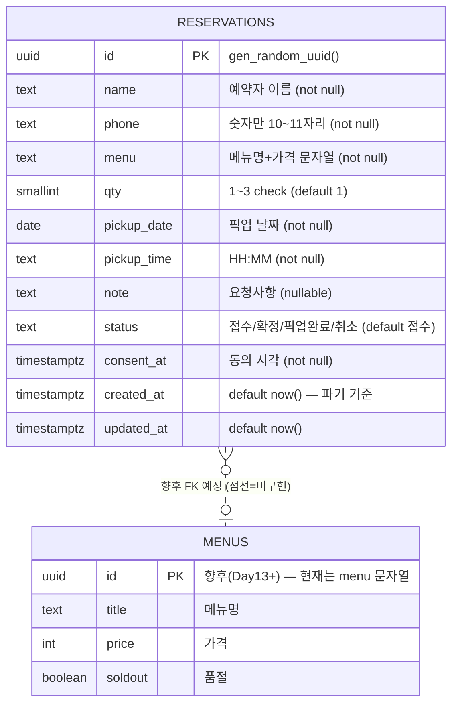

# B-11-R1 — 수집 필드 메모 + ERD

> 관리번호: **B-11-R1** (기초반 · 11일차 · 조사자료 1) · 작성일: 2026-07-20
> 유래: B-10-O4(3주차 데이터 필드 초안) — Day 04 확정 JSON 12필드를 서버 스키마로 승계

## 수집 항목 (교재 요구: 3~5개 핵심 메모)

| # | 항목 | 왜 받나 |
|---|---|---|
| 1 | 이름·연락처 | 픽업 호명·노쇼 연락 (개인정보 최소 수집) |
| 2 | 메뉴·수량 | 준비할 것 (수량 1~3, 슬롯 정책) |
| 3 | 픽업 날짜·시간 | 슬롯 관리의 축 (08~10시, 10분 단위) |
| 4 | 동의 시각 | 개인정보 수집 동의 증빙 (보유 1개월 파기 기준은 created_at) |
| 5 | 요청사항 (선택) | 서비스 품질 |

## ERD

- **오늘 만드는 것은 `reservations` 1개 테이블** (교재 범위). `menus`는 향후 확장 자리만 표시(현재는 메뉴를 문자열로 저장 — localStorage 구조와 동일해 이관 단순).
- 슬롯 상한(같은 날짜+시간 합계 3잔)·영업시간(08~10시)·월요일 휴무는 **서버가 강제** (check 제약 + INSERT 트리거) — 일관성 검토에서 '브라우저만의 진실'로는 서비스 불가 판정되어 Day 11에 반영.

## RLS 설계 (허용/금지)

| 동작 | 익명(publishable key) | 이유 |
|---|---|---|
| INSERT | ✅ 허용 | 고객 예약 접수 — 오늘의 목적 (규칙은 서버 check·트리거가 강제) |
| SELECT | ⛔ 금지 | 예약(개인정보) 공개 조회 차단 — 조회는 아래 RPC 통로로만 |
| UPDATE/DELETE | ⛔ 금지 | 변조·삭제 차단 — 취소는 cancel_reservation RPC로만 |
| 사장 확인 | 대시보드 Table Editor (로그인 필요) | Day 13에서 관리 화면 개선 |

### RPC 통로 (테이블은 잠그고, 정해진 답만 내주는 창구)

| 함수 | 반환 | 안전 근거 |
|---|---|---|
| `slot_status(날짜)` | 시간별 잔 수만 | 개인정보 필드 없음 |
| `my_reservations(이름, 전화)` | 둘 다 일치하는 본인 예약만 | 남의 예약 조회 불가 |
| `cancel_reservation(id, 이름, 전화)` | 성공 여부 | 본인 일치 + '접수' 상태만 취소 |
