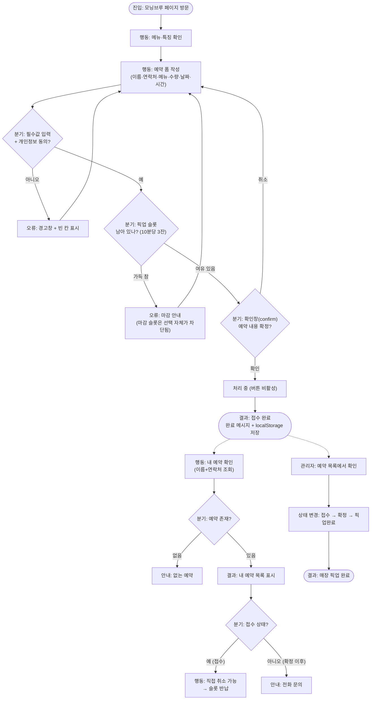

# B-07-O1 — 모닝브루 사용자 흐름도 (Mermaid)

> 관리번호: **B-07-O1** (기초반 · 7일차 · 산출물 1) · 작성일: 2026-07-14
> 근거: 실제 구현된 통합 페이지(B-05-O1/B-06-O1)의 동작 그대로 — 진입·행동·결과·분기(오류 경로 포함)
> 렌더 확인: 로컬 Mermaid 렌더 + 캡처 (`B-07-O1.png`) / mermaid.live 에서도 동일 확인 가능

## 흐름 구성 요약

| 요소 | 내용 |
|---|---|
| **진입** | 페이지 방문 (검색·공유 링크) |
| **행동** | 메뉴 확인 → 폼 작성 → (접수 후) 내 예약 확인 |
| **분기 4개** | ①필수값·동의 ②슬롯 여유 ③confirm 확정 ④(조회 시) 예약 존재·상태 |
| **오류 경로** | 빈 칸 경고 / 슬롯 마감 / 없는 예약 — 모두 폼·안내로 복귀 (막다른 길 없음) |
| **결과** | 접수 완료(저장) → 관리자 확정 → 매장 픽업 완료 |
